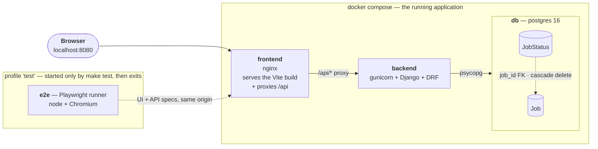

# Job Management Dashboard

View, create and manage computational jobs. Django + PostgreSQL behind a React/TypeScript
frontend, containerized, with a Playwright end-to-end suite.

**144 E2E specs, 43 backend unit tests, green from a cold build.**

---

## Quick start

Requires only `make`, `docker`, `docker compose` and `bash`. Every image comes from DockerHub.

```bash
make test    # the gate: build, start the stack, run the E2E suite
make up      # start the stack and print the URLs
```

> The first run builds three images and downloads a browser for the test container.

`make up` serves the app on <http://localhost:8080> and prints the API and database URLs.
`make test` publishes **no host ports at all**, so a port already in use on your machine cannot
fail the build.

<details>
<summary>All commands</summary>

| Command | What it does |
|---|---|
| `make build` | Build all images |
| `make up` | Start the stack and wait until healthy |
| `make test` | **The gate.** Build, start, run the Playwright E2E suite |
| `make test-spec SPEC=03-update-job-api` | Run one spec against the running stack |
| `make test-backend` | Backend unit tests (pytest-django) |
| `make test-all` | Both suites |
| `make seed N=250000` | Seed jobs with realistic status histories |
| `make db-url` / `make psql` | Connection string / a psql shell |
| `make logs` / `make ps` / `make shell` | Tail logs / service status / Django shell |
| `make stop` / `make down` / `make clean` | Stop / remove containers / full reset |
| `make clean-all` | Also drop base images and the build cache — a genuinely cold start |
| `make time` | Print the project time log |

</details>

---

## Architecture



nginx serves the built frontend **and** proxies `/api`, so the browser and the tests see a single
origin — no CORS anywhere, no API base URL baked in at build time. The Playwright suite is itself
a compose service behind a `test` profile, which is what makes `make test` self-contained on a
machine that has only Docker.

Component detail: **[backend/README.md](backend/README.md)** · **[frontend/README.md](frontend/README.md)**

### Append-only log, conditional status projection

`JobStatus` is an **append-only event log**. `Job.current_status` / `current_status_at` are a
**projection** of it, written only by `services.record_status()`, in the same transaction as the
event.

The event is appended unconditionally, so duplicate/simultaneous events will all be logged, but only the projection is conditional. That is what makes the
write safe to replay, and keeps the log authoritative if the projection ever has to be rebuilt.

The projection exists for one query: `?status=RUNNING`. Deriving status on read is fine for an unfiltered page, but *filtering* by it would make Postgres compute the
latest status for every job before applying the predicate, which is a full scan that no index can help.


### Status transitions

Enforced in `jobs/transitions.py` and mirrored in the UI from the API's `allowed_transitions`, so
an illegal move is *unreachable* rather than merely rejected — and the state machine is never
duplicated in TypeScript.

```
PENDING   → RUNNING, FAILED, CANCELED
RUNNING   → COMPLETED, FAILED, CANCELED
COMPLETED → ∅                          terminal: the work succeeded
FAILED    → ∅  + Re-run → PENDING      terminal, retryable
CANCELED  → ∅  + Re-run → PENDING      terminal, retryable
```

You retry work that failed or did not finish; re-running something that *succeeded* would require a new job to re-run it. A pending or running job can also be canceled.

---

## API

| | |
|---|---|
| `GET /api/jobs/` | List, newest first, cursor-paginated. `?status=` (repeatable, OR-ed) and `?search=` apply server-side across the whole table |
| `POST /api/jobs/` | Create. Job and its first `PENDING` status in one transaction |
| `GET /api/jobs/<id>/` | Retrieve |
| `PATCH /api/jobs/<id>/` | Rename and/or change status. `status` is a write-only instruction to append to the log |
| `DELETE /api/jobs/<id>/` | Delete, cascading to the status log |
| `GET /api/jobs/<id>/statuses/` | Status history, newest first, cursor-paginated |
| `GET /api/health/` | Liveness + database readiness |

Every 4xx and 5xx uses one shape, so the frontend has a single parsing path:

```json
{ "detail": "human-readable summary", "errors": { "name": ["This field may not be blank."] } }
```

---

## Performance

The brief asks about **millions of jobs**. Working assumption: the dataset is large, but a single
user's viewport is not — so every query costs proportional to the **page**, not the table.

**Cursor pagination, never offset**, with composite indexes covering the exact `ORDER BY` and
`WHERE`. Measured at 250,000 rows, same page, same data:

| Query | Time |
|---|---|
| Keyset seek | **0.101 ms** |
| `OFFSET 200000 LIMIT 25` — the same page, the other way | 39.7 ms |
| `COUNT(*)` — what `PageNumberPagination` adds to *every* request | 30.6 ms |

~390× on the seek, and the count DRF would run per page load costs more than serving the page.

Search is indexed with a GIN trigram index on `UPPER(name::text)` — the expression Django actually
emits for `icontains`, which matters more than it sounds.

**Full writeup, including three features deliberately not built and why:
[docs/PERFORMANCE.md](docs/PERFORMANCE.md)**

---

## Testing

`make test` runs the **Playwright E2E suite and nothing else** — 144 specs. Backend unit tests run
separately under `make test-backend`, deliberately outside the gate, so an unrelated unit failure
cannot block the evaluation.

Backend-only steps are tested through Playwright's `request` fixture rather than a second
framework, so there is one runner and one `make test` from step 0 onward.

| Tier | Command | When |
|---|---|---|
| **T1** | `make test-spec SPEC=…` — one spec, no rebuild | while iterating |
| **T2** | `make test` — the full suite (but not a cold build) | at the close of every step |
| **T3** | `make clean-all && make build && make test`, an amd64 build check, then eyeball the database | steps 0, 4, 7, 11 and any change to the build surface |

T3 validates the cold build and provision path, which ensures that there are no regressions on the entire build at the larger touchpoints.

Error handling is part of each step's definition of done, so failure specs ship with the feature
rather than in one pass at the end. Faults are injected with `page.route()` — no fault-injection
library, no test-only code path in the app.

E2E runs against a real Postgres, so no spec assumes an empty database; each namespaces its
fixtures with a run-unique prefix, which is what makes the suite re-runnable without `make clean`.

The full case matrix is in **[docs/TEST_PLAN.md](docs/TEST_PLAN.md)** - these are the 61 distinct scenarios I planned for in the test plan (21 of them negative); 144 is the number of actual Playwright assertions that collectively prove them (most cases need more than one assertion to be considered actually verified.)

---

## Code reviews

Three rounds ran during the build. **27 findings, all closed**, each recorded with what it found
and what was done: **[docs/reviews/](docs/reviews/)**

The two most useful were not bugs in the application but tests that passed while proving something
other than what they claimed — a spec that deleted rows belonging to *other* specs, and a delete
test that would have passed with the rollback deleted. A third found a database index that could
not serve the query it was built for, under a performance claim measured on the wrong SQL.

---

## AI usage & prompt engineering

I used Claude Code with Opus 5 for this project. I have been using Opus 4.8 quite a bit and was familiar/pleased with it; when Opus 5 was released very shortly before I started this project, I wanted to try it out. I realize it was a bit risky to use such a new release but I was curious about it. 

I spent a little time ramping up on the different technologies and
doing a little research by browsing the internet and using Claude chat, which isn't captured here.
When I was ready to start coding, I initially went in recording my interactions with Claude Code but soon realized that there was a lot of multi-tasking while waiting around for Claude to make changes / often leaving my computer
in between (plus I didn't want to eat into my laptop's 8GB RAM) so I stopped the
recording and went with transcripts. The transcripts are saved in [`docs/transcripts/`](docs/transcripts/).

My general approach was to first come up with a plan with concrete, testable steps before writing any code or design. I also had the agent make a mock-up of the UI to see it upfront - sometimes I don't catch issues in the data model / general logic until after seeing the UI, or small-seeming UI changes require major backend changes, so I wanted to catch them early.  I also wanted
to write the tests before the entire app was finished, so I opted to split the work into steps that could  be tested with an
end-to-end Playwright test.  I gave the agent instructions to run the full test suite on all the steps, adding some new tests along the way. At the bigger touch points, I also instructed it to run the tests on a fresh build to make sure there weren't any build regressions.

Even with the test plan and end-to-end testing along the way, I was worried about the agent "cheating" on some of the tests. While I did give specific instructions to not change a test without my permission, there are times when a bug is masked because a test is written using the same incorrect assumptions that led to the bug / looking at how the code works rather than how it's supposed to work. I opened separate code reviews through Claude's built-in `code-review` that were really helpful for this. I thought they would mostly be re-factoring/stylistic findings, but there were quite a few actual issues, mostly with the test correctness. I had the agent explain each of the findings and the fixes where applicable. 

I focused on reviewing the design docs and test plan to make sure the high-level ideas were sound. I did also look through the code myself, but Claude produces a lot of code and reviewing it line-by-line wasn't feasible with the time constraints of the assignment. I split the files into three categories: 

1. a few files with the
core functionality that I read line by line and sought to understand deeply - those were in the backend, like `models.py`, `services.py`, `transitions.py` and `pagination.py`
2. files with some more
boilerplate code/schemas that I sanity checked and understood their general shape (docker files,
makefile, serializers), and 
3. the files that I essentially just made sure I knew their purpose in the architecture and that they exist (configs, CSS, etc.). 

I asked the agent to explain some parts of the code to me. I didn't ask for too many specific changes from reading the code, but there were some discussions that led to design changes.  I think only one concrete change came out of looking at the code, which was a variable naming change that was in a core part of the code so I wanted it to be easy to read. 

For the UI, I mostly relied on manual testing to inspect the implementation and iterate with the agent. I caught a few bugs by clicking around.

Almost all the code was written by the agent based on conversations with me, except some manual edits I made to this README to make it more readable. This entire section was written by me, as well as most of the "Time spent" section (except the raw numbers, which came from the agent). 

### Session transcripts

| | Session | What it covers |
|---|---|---|
| 0 | [midday](docs/transcripts/ai-session-transcript-0-2026-07-25-midday.txt) | Spec, step plan and test plan; steps 0–7 — the backend and the UI through the required critical flow |
| 1 | [afternoon](docs/transcripts/ai-session-transcript-1-2026-07-25-afternoon.txt) | Steps 8–10, two code-review rounds, the scope cuts |
| 2 | [forked session](docs/transcripts/ai-session-transcript-2-2026-07-25-forked-session.txt) | A branch off the main thread |
| 3 | [delivery](docs/transcripts/ai-session-transcript-3-2026-07-27-delivery.txt) | Step 11 delivery — Linux `make clean` fix, `npm ci` lockfile pinning, README arch diagram and time writeup |

Session 0 (midday) is the full session recovered from Claude Code's local session log after a
`/clear` — those live in `~/.claude/projects/` and are not deleted by clearing the context. It
starts at the first prompt, so it already contains the early planning and backend work; a separate
live-terminal export of that same stretch was redundant, so it was dropped.

---

## Time spent

The time tracked by the agent is
**4h 43m**, tracked as the work happened where possible.
`scripts/timelog.sh` opens and closes each session; `make time` renders
[`docs/TIME_LOG.md`](docs/TIME_LOG.md) in local time, while the ledger stores UTC.

However, this number doesn't really capture the time fully - a lot of that time was me waiting for the agent to finish something. During some of the wait times I was reviewing code or researching, but there were periods where I was doing things not related to this project / away from my computer. There is some time I spent testing the build myself on other laptops that isn't captured here as well. 

My overall feeling is that I spent too much time on this project given the "within a few hours" spirit of this assignment. I started it Saturday morning and I was optimistic that I would finish it by lunchtime, but I ended up spending a lot of time waiting around. I was kind of on-and-off the project all throughout the day, and I made some more small tweaks the next two evenings. There are two things I'd do differently if I were to do it again:
- First, I would have used a different computer. I used my personal laptop, which is a Mac with an Intel chip and 8GB of RAM. I opted for that rather than my Desktop to be more mobile, but after I completed the assignment I realized that a clean build by Claude was taking 20-40 minutes. When I ran it outside of Claude, it took 11 minutes so I think there were some RAM/swap issues, but when I ran the same build on my Desktop which has an M2 chip, it only took 5 minutes. On a Linux machine with 64 GB it only took 3 minutes. So I would have been happier on a not-so-slow computer in hindsight.
- Second, I wish I had practiced more restraint at the scope creep on the UI. I went into the assignment planning on implementing only what was in the requirements doc, but when I actually went in and looked at the UI I couldn't help myself from adding some more improvements, sometimes later in the process than I wish. I would have implemented the bare minimum and used the future ideas as discussion points for later rather than getting lost in the weeds of the UI.

At one point I questioned whether I added too many tests because the assignment said "at least one," but I really like the test plan we came up with and it made me more confident in the agent's changes; I just wish my slow computer could run them faster.

---

## Project layout

```
backend/README.md      backend architecture and file guide
frontend/README.md     frontend architecture and file guide
backend/jobs/          models, services, transitions, views, serializers, pagination
frontend/src/          api client, hooks, components
e2e/tests/             Playwright specs, one per step
docs/                  spec, plan, test plan, open questions, performance, mockup
docs/reviews/          three code-review rounds and their resolutions
docs/transcripts/      AI session transcripts
```
---

## Planning docs

Planning docs: [`SPEC.md`](docs/SPEC.md) · [`PLAN.md`](docs/PLAN.md) · [`docs/OPEN_QUESTIONS.md`](docs/OPEN_QUESTIONS.md) · [`TEST_PLAN.md`](docs/TEST_PLAN.md) · [UI mockup](docs/mockup/dashboard-mockup.html)

