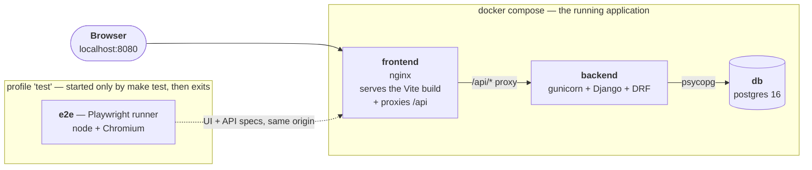

# Job Management Dashboard

View, create and manage computational jobs. Django + PostgreSQL behind a React/TypeScript
frontend, containerized, with a Playwright end-to-end suite.

**144 E2E specs, 43 backend unit tests, green from a cold build.**

---

## Quick start

Requires only `make`, `docker`, `docker compose` and `bash`. Every image comes from DockerHub.

```bash
make test    # the gate: build, start the stack, run the E2E suite
make up      # start the stack and print the URLs
```

> **First run builds three images and downloads a browser for the test container.** On a cold
> machine that takes a while and is mostly quiet — it has not hung. Later runs are ~3 minutes.

`make up` serves the app on <http://localhost:8080> and prints the API and database URLs.
`make test` publishes **no host ports at all**, so a port already in use on your machine cannot
fail the build.

<details>
<summary>All commands</summary>

| Command | What it does |
|---|---|
| `make build` | Build all images |
| `make up` | Start the stack and wait until healthy |
| `make test` | **The gate.** Build, start, run the Playwright E2E suite |
| `make test-spec SPEC=03-update-job-api` | Run one spec against the running stack |
| `make test-backend` | Backend unit tests (pytest-django) |
| `make test-all` | Both suites |
| `make seed N=250000` | Seed jobs with realistic status histories |
| `make db-url` / `make psql` | Connection string / a psql shell |
| `make logs` / `make ps` / `make shell` | Tail logs / service status / Django shell |
| `make stop` / `make down` / `make clean` | Stop / remove containers / full reset |
| `make clean-all` | Also drop base images and the build cache — a genuinely cold start |
| `make time` | Print the project time log |

</details>

---

## Architecture



nginx serves the built frontend **and** proxies `/api`, so the browser and the tests see a single
origin — no CORS anywhere, no API base URL baked in at build time. The Playwright suite is itself
a compose service behind a `test` profile, which is what makes `make test` self-contained on a
machine that has only Docker.

Component detail: **[backend/README.md](backend/README.md)** · **[frontend/README.md](frontend/README.md)**

### The one idea worth understanding

`JobStatus` is an **append-only event log**. `Job.current_status` / `current_status_at` are a
**projection** of it, written only by `services.record_status()`, in the same transaction as the
event.

The projection exists for one query: `?status=RUNNING`. Deriving status on read is perfectly
normalized and fine for an unfiltered page, but *filtering* by it would make Postgres compute the
latest status for every job before applying the predicate — a full scan no index can help.

The event is appended unconditionally; only the projection is conditional. That is what makes the
write safe to replay, and keeps the log authoritative if the projection ever has to be rebuilt.

### Status transitions

Enforced in `jobs/transitions.py` and mirrored in the UI from the API's `allowed_transitions`, so
an illegal move is *unreachable* rather than merely rejected — and the state machine is never
duplicated in TypeScript.

```
PENDING   → RUNNING, FAILED, CANCELED
RUNNING   → COMPLETED, FAILED, CANCELED
COMPLETED → ∅                          terminal: the work succeeded
FAILED    → ∅  + Re-run → PENDING      terminal, retryable
CANCELED  → ∅  + Re-run → PENDING      terminal, retryable
```

You retry work that did not finish; re-running something that *succeeded* is a new job.
**Canceling is not deleting** — a canceled job still consumed compute time, and that history is
worth auditing.

---

## API

| | |
|---|---|
| `GET /api/jobs/` | List, newest first, cursor-paginated. `?status=` (repeatable, OR-ed) and `?search=` apply server-side across the whole table |
| `POST /api/jobs/` | Create. Job and its first `PENDING` status in one transaction |
| `GET /api/jobs/<id>/` | Retrieve |
| `PATCH /api/jobs/<id>/` | Rename and/or change status. `status` is a write-only instruction to append to the log |
| `DELETE /api/jobs/<id>/` | Delete, cascading to the status log |
| `GET /api/jobs/<id>/statuses/` | Status history, newest first, cursor-paginated |
| `GET /api/health/` | Liveness + database readiness |

Every 4xx and 5xx uses one shape, so the frontend has a single parsing path:

```json
{ "detail": "human-readable summary", "errors": { "name": ["This field may not be blank."] } }
```

---

## Performance

The brief asks about **millions of jobs**. Working assumption: the dataset is large, a single
user's viewport is not — so every query costs proportional to the **page**, not the table.

**Cursor pagination, never offset**, with composite indexes covering the exact `ORDER BY` and
`WHERE`. Measured at 250,000 rows, same page, same data:

| Query | Time |
|---|---|
| Keyset seek | **0.101 ms** |
| `OFFSET 200000 LIMIT 25` — the same page, the other way | 39.7 ms |
| `COUNT(*)` — what `PageNumberPagination` adds to *every* request | 30.6 ms |

~390× on the seek, and the count DRF would run per page load costs more than serving the page.

Search is indexed with a GIN trigram index on `UPPER(name::text)` — the expression Django actually
emits for `icontains`, which matters more than it sounds.

**Full writeup, including three features deliberately not built and why:
[docs/PERFORMANCE.md](docs/PERFORMANCE.md)**

---

## Testing

`make test` runs the **Playwright E2E suite and nothing else** — 144 specs. Backend unit tests run
separately under `make test-backend`, deliberately outside the gate, so an unrelated unit failure
cannot block the evaluation.

Backend-only steps are tested through Playwright's `request` fixture rather than a second
framework, so there is one runner and one `make test` from step 0 onward.

| Tier | Command | When |
|---|---|---|
| **T1** | `make test-spec SPEC=…` — one spec, no rebuild | while iterating |
| **T2** | `make test` — the full suite | at the close of every step |
| **T3** | `make clean-all && make build && make test`, an amd64 build check, then eyeball the database | steps 0, 4, 7, 11 and any change to the build surface |

T1→T2 is a scope axis. **T2→T3 is not** — identical assertions, different starting state. T3
validates the build and provision path: files that exist only in a stale layer, migrations that
assume an already-migrated database, dependencies resolving from a warm cache. That class of defect
passes warm and fails cold.

Error handling is part of each step's definition of done, so failure specs ship with the feature
rather than in one pass at the end. Faults are injected with `page.route()` — no fault-injection
library, no test-only code path in the app.

E2E runs against a real Postgres, so no spec assumes an empty database; each namespaces its
fixtures with a run-unique prefix, which is what makes the suite re-runnable without `make clean`.

Full case matrix — 61 cases, 21 negative: **[docs/TEST_PLAN.md](docs/TEST_PLAN.md)**

---

## Code reviews

Three rounds ran during the build. **27 findings, all closed**, each recorded with what it found
and what was done: **[docs/reviews/](docs/reviews/)**

The two most useful were not bugs in the application but tests that passed while proving something
other than what they claimed — a spec that deleted rows belonging to *other* specs, and a delete
test that would have passed with the rollback deleted. A third found a database index that could
not serve the query it was built for, under a performance claim measured on the wrong SQL.

---

## Design decisions

Recorded with their reasoning in [`docs/OPEN_QUESTIONS.md`](docs/OPEN_QUESTIONS.md) — what was
asked, what was decided, and what was assumed without asking. Four worth surfacing:

- **The projection guard compares `current_status_at`, never `updated_at`.** Any save bumps
  `updated_at` — including a rename — so guarding on it would let renaming a job silently discard a
  later status event.
- **Sequential bigint ids, kept for readability.** "Job 3284917 is stuck" is usable in a support
  ticket; a UUID is not. The trade-off is enumerability, which matters once auth exists — and the
  answer then is UUIDv7, not v4.
- **Status stored as text**, not an int or a native `ENUM`. Readable in psql, in logs, and on the
  wire; adding `CANCELED` was a no-op migration. Renaming it later cost a data migration, which is
  the same coin.
- **No authentication, no multi-tenancy.** The brief never introduces a user concept.

Planning docs: [`SPEC.md`](docs/SPEC.md) · [`PLAN.md`](docs/PLAN.md) ·
[`TEST_PLAN.md`](docs/TEST_PLAN.md) · [UI mockup](docs/mockup/dashboard-mockup.html)

---

## AI usage & prompt engineering

The assignment took a bit longer than I anticipated (see time breakdown below), but a lot of it was
waiting around for the agent. I initially went in recording my interactions with Claude from the very
beginning, but soon realized that there would be some multi-tasking and waiting around / taking pauses
in between (plus I have an old-ish Mac and I didn't want to eat into its 8GB RAM) so I stopped the
recording. The transcripts are saved in [`docs/transcripts/`](docs/transcripts/).

I spent a little time before working with Claude Code ramping up on the different technologies and
doing a little research by browsing the internet and using Claude chat, which isn't captured here.
When I was ready to start coding, I went with an approach of iterating on a spec and test plan first,
coming up with a plan that involved smaller testable pieces, and then executing on the plan. I wanted
to be able to write the tests before the entire app was finished but I didn't want to just write a
bunch of failing tests so I opted to split the work into steps that could still be tested with an
end-to-end Playwright test. I did give instructions to generally do lighter-weight tests on an
already-running build rather than the entire `make test` every time, with `make test` at the bigger
touchpoints.

Even with the test plan and end-to-end testing along the way, I also wanted to understand the code.
Claude does produce a lot of code and I made sure to review the pieces that did the core
functionality — like creating a new job and ensuring it appears in the list, updating the job status,
deleting a job and its job statuses. There were basically 3 categories of files — the files with the
core functionality that I read line by line and sought to understand deeply, the files with some more
boilerplate code/schemas that I sanity checked and understood their general shape (docker files,
makefile, serializers), and the files that I essentially just made sure I knew their purpose and that
they exist (configs, CSS, etc.). I did ask the agent to explain some parts of the code to me. I asked
for some small changes, like variable naming to make it more readable etc. Most of the bigger changes
and architecture decisions were made during design.

### Session transcripts

| | Session | What it covers |
|---|---|---|
| 0 | [morning](docs/transcripts/ai-session-transcript-0-2026-07-25-morning.txt) | Spec, step plan and test plan; steps 0–4, the backend |
| 1 | [midday](docs/transcripts/ai-session-transcript-1-2026-07-25-midday.txt) | Steps 5–7, the UI through the required critical flow |
| 2 | [afternoon](docs/transcripts/ai-session-transcript-2-2026-07-25-afternoon.txt) | Steps 8–10, two code-review rounds, the scope cuts |
| 3 | [forked session](docs/transcripts/ai-session-transcript-3-2026-07-25-forked-session.txt) | A branch off the main thread |

Session 1 was recovered from Claude Code's local session log after a `/clear` — those live in
`~/.claude/projects/` and are not deleted by clearing the context, which is worth knowing.

---

## Time spent

**4h 10m**, tracked as the work happened where possible rather than reconstructed at the end.
`scripts/timelog.sh` opens and closes each session; `make time` renders
[`docs/TIME_LOG.md`](docs/TIME_LOG.md) in local time, while the ledger stores UTC.

| Where it went | Time | |
|---|---|---|
| Planning — spec, step plan, test plan, tracker (same session shipped steps 0–1) | 25m | 10% |
| Backend — create, `PATCH` + state machine, delete + cascade, `CANCELED` | 55m | 22% |
| Frontend — job list, create form, status update, delete | 87m | 35% |
| Scale and fault injection — 250k measurement, failure paths | 26m | 10% |
| Review rounds — three of them, and the fixes they produced | 40m | 16% |
| Late feedback — dialog copy, respelling, terminology, search | 18m | 7% |

**Those categories are cleaner than the sessions were.** One 25-minute session covered *both* a
round of review fixes and the job list, so frontend is overstated and review understated by roughly
ten minutes. Step 7's 40 minutes — the largest single block — was substantially T3 validation of the
assignment's required end-to-end flow rather than writing code. Two entries have reconstructed start
times, marked as such in the log.

Excluded deliberately: the wall-clock cost of Docker builds and test runs, which is machine time
rather than work.

Two things worth drawing out. **The frontend cost more than the backend** even after correcting for
the mixing — the backend is a state machine with a projection, and once `record_status()` existed
the rest followed; the UI is where every partial state lives, and where all three review rounds
concentrated. And **review is about a sixth of the total**, which is the number I would defend
first.

---

## Project layout

```
backend/README.md      backend architecture and file guide
frontend/README.md     frontend architecture and file guide
backend/jobs/          models, services, transitions, views, serializers, pagination
frontend/src/          api client, hooks, components
e2e/tests/             Playwright specs, one per step
docs/                  spec, plan, test plan, open questions, performance, mockup
docs/reviews/          three code-review rounds and their resolutions
docs/transcripts/      AI session transcripts
```
