# Build Plan — Steps

Each step is **independently shippable and independently green**. Backend-only steps are still verified
by Playwright, using its `request` fixture (`APIRequestContext`) — same runner, same `make test`, no second
test framework to stand up. UI steps layer on top.

Rule: no step starts until the previous step's validation passes. Commit per step.

Related: [SPEC.md](./SPEC.md) · [TEST_PLAN.md](./TEST_PLAN.md) · [OPEN_QUESTIONS.md](./OPEN_QUESTIONS.md)

---

## Architecture

**`e2e` is the Playwright test container** — the E2E suite packaged as a service, behind a `test` profile
so `make up` never starts it. `make test` builds it, runs it once against the live stack, and it exits with
the suite's status code; that is what keeps `make test` self-contained on a machine with only make, docker
and bash.

It drives the app through the same nginx origin the browser uses — API specs included — so the tests
exercise the real request path, proxy and all. That single origin is also why there is no CORS config
anywhere and no API base URL baked in at build time.

The status write is the one piece of non-obvious logic, so it gets its own diagram:

```mermaid
sequenceDiagram
    autonumber
    participant UI as React (optimistic)
    participant API as DRF JobViewSet
    participant SVC as services.record_status()
    participant DB as Postgres

    UI->>UI: badge → RUNNING immediately
    UI->>API: PATCH /api/jobs/12/ {status:"RUNNING"}
    API->>SVC: record_status(job, RUNNING)

    rect rgb(30,41,59)
    note over SVC,DB: transaction.atomic()
    SVC->>DB: SELECT … FOR UPDATE (job row lock)
    SVC->>DB: INSERT JobStatus(job, RUNNING, now())
    alt new.timestamp >= job.current_status_at
        SVC->>DB: UPDATE job SET current_status, current_status_at
    else stale / replayed event
        SVC-->>SVC: append only, projection untouched
    end
    end

    API-->>UI: 200 {current_status:"RUNNING", …}
    UI->>UI: reconcile cache
    Note over UI: on 4xx/5xx → roll back badge,<br/>surface ErrorBanner
```

The log is appended unconditionally; only the **projection** is conditional. That's what makes the write
safe to replay, and what keeps the log authoritative if the projection ever needs rebuilding.

---

## Error handling is cross-cutting, not a step

It is part of each step's definition of done, never retrofitted:

| Layer | Built in | What it does |
|---|---|---|
| DRF exception handler → uniform `{detail, errors}` | Step 1 | every 4xx/5xx has one predictable shape |
| Model + serializer validation | Step 2 | rejects blank/oversized names at the boundary |
| Typed client normalizes network + HTTP + parse failures | Step 5 | one `ApiError` type, one place to change |
| `ErrorBanner` + query error states | Step 5 | no blank screens, ever |
| Client-side form validation | Step 6 | blocks the request before it is sent |
| Optimistic mutation + rollback on failure | Step 7 | the UI never lies about persisted state |

Step 10 is therefore a **fault-injection pass** — a spec that systematically proves the handling built in
steps 1–9 holds under 500s, aborts, and slow responses — not the place where handling gets written.

---

## Validation tiers

| Tier | Command | Cost | When |
|---|---|---|---|
| **T1 — lightweight** | `make test-spec SPEC=<name>` (one spec, running stack, no rebuild) · `make test-backend` | seconds | after every meaningful change, inside a step |
| **T2 — suite** | `make test` (rebuild + full Playwright suite) | ~1–2 min | close of **every** step |
| **T3 — cold gate** | `make clean && make build && make test` from pruned Docker + `--platform linux/amd64` check | several min | steps **0, 4, 7, 11**, and any step touching Docker/compose/Makefile/dependencies |

---

## Steps

Legend: **S** = size · **Spec** = the Playwright file that proves it · **Cases** = IDs from
[TEST_PLAN.md](./TEST_PLAN.md) §3.

### Step 0 — Walking skeleton
**S: M** · **Spec:** `00-smoke` · **Cases:** A1, A2, A4 · **Validation: T3**

Compose stack (db + backend + frontend + e2e), Dockerfiles, Makefile (`build up test test-spec
test-backend test-all stop clean seed logs time`), `GET /api/health/`, React app rendering a title.

- `GET /api/health/` → 200, `{status:"ok", database:"ok"}`
- UI: page loads, heading visible, no console errors

*Why first:* `make test` passing on a clean machine is the one gate the evaluation cannot get past. Build
the pipe before the water.

### Step 1 — Models + list endpoint
**S: M** · **Spec:** `01-jobs-list-api` · **Cases:** E1, E2, E7, E8 · **Validation: T1 → T2**

Models, migrations, composite indexes, DRF serializer, cursor-paginated `GET /api/jobs/`, uniform exception
handler, `seed_jobs` management command.

- `{results, next, previous}` shape; each result carries `id, name, current_status, current_status_at,
  created_at, updated_at`
- newest-first, stable across reloads
- `?page_size=2` → 2 results + non-null `next`; following `next` returns a **disjoint** set

### Step 2 — Create + automatic PENDING
**S: S** · **Spec:** `02-create-job-api` · **Cases:** B1, B2, B3, B4, B6, B7 · **Validation: T1 → T2**

`POST /api/jobs/`, atomic job + initial status, name validation. A job must never exist with an empty log.

### Step 3 — PATCH: append event, update projection
**S: M** · **Spec:** `03-update-job-api` · **Cases:** C1, C3–C8, C10, C11, C13 · **Validation: T1 → T2**

Write-only `status` serializer field, `record_status()` with `select_for_update()` + atomic block, the
monotonic guard, and `transitions.py` enforcing the state machine (Q7). C11 (two concurrent PATCHes, no
lost update) is the case that proves the lock; C6 pins the idempotent no-op that keeps a double-click from
becoming a 400.

### Step 4 — Delete + cascade + history endpoint
**S: S** · **Spec:** `04-delete-job-api` · **Cases:** D1, D2, D3, D4 · **Validation: T3** (backend complete)

`DELETE` → 204 with the ORM cascade removing every `JobStatus` row; `GET /api/jobs/<id>/statuses/`.
D2 proves the history is unreachable via the API, D3 (backend unit) proves no orphan rows survive — the
E2E check alone cannot tell those apart.

### Step 1.5 — UI mockup, design & test-plan sign-off 🔍
**S: S** · **Spec:** none — this is the review gate · **Validation: explicit approval before step 5**

One self-contained HTML page showing **every state the UI can be in**, with hard-coded data, no backend and
no React. Reviewed and approved before a line of component code is written.

States it must show:

| Area | States |
|---|---|
| Job list | populated (all four status badges), empty, loading, error + retry |
| Create form | idle, invalid (empty / whitespace), submitting, server error with input preserved |
| Status control | dropdown closed, dropdown open, update in flight (optimistic), rolled back after failure |
| History | timeline collapsed, expanded |
| Delete | button, in-app confirm dialog (never `window.confirm`), row-restored-after-failure |
| Scale controls | status filter, "load more" affordance, end-of-list |

*Why the gate exists:* a layout or interaction problem caught on a static page costs minutes. The same
problem caught after steps 5–8 are wired through TanStack Query means unpicking components, tests and
optimistic-update logic that were all built on the wrong shape.

*Why it sits at 1.5:* it has **no backend dependency**, so it is built as soon as there is a harness to show
it against, and reviewed **in parallel with steps 2–4** rather than blocking them. The only hard constraint
is approval before step 5 starts.

*Both sign-offs land here.* The **test plan** is approved at this same point — reviewing it alongside a
working harness and a clickable UI gives far more to react to than reading a case matrix cold. Steps 5–11
are what the approved plan governs, so nothing downstream proceeds until both are signed.

Deliverable: a viewable page (published artifact link) plus the same file committed under `docs/mockup/`.

### Step 5 — Frontend: job list
**S: M** · **Spec:** `05-job-list-ui` · **Cases:** E1, E3, E6 · **Validation: T1 → T2**

Typed API client, TanStack Query, `JobList`/`JobRow`/`StatusBadge`/`StatusTimeline`/`ErrorBanner`, loading
and empty states, styling pass.

### Step 6 — Frontend: create form
**S: S** · **Spec:** `06-create-job-ui` · **Cases:** B1, B2, B3 · **Validation: T1 → T2**

Empty and whitespace-only names blocked client-side with **zero network requests**; valid name appears at
the top of the list without a refresh; input clears on success.

### Step 7 — Frontend: status update ⭐
**S: M** · **Spec:** `07-update-status-ui` · **Cases:** C1, C2, C12, C9 · **Validation: T3**

*The prompt's named critical flow — the one an evaluator looks for first.*

Create → assert `PENDING` → change to `RUNNING` → badge updates → **survives reload**. All four states
reachable. Optimistic update with rollback on failure.

### Step 8 — Frontend: delete
**S: S** · **Spec:** `08-delete-job-ui` · **Cases:** D1, D5, D6 · **Validation: T1 → T2**

Row disappears without refresh and stays gone after reload. Any confirm step is an in-app dialog —
**never `window.confirm`**, which blocks automation and would hang the suite.

Also picks up the two `client.ts` error branches nothing previously exercised, pulled forward from the
fault-injection pass:
`route.abort()` (network failure → `ApiError(0)`, the thing that decides whether Retry appears) and a
non-JSON body (a proxy error page). Every network call goes through that file, so its failure paths are
worth covering before the last step rather than after.

### Step 9 — Scale: pagination and filter
**S: M** · **Spec:** `09-pagination-scale` · **Cases:** F1–F3, F5–F9 · **Validation: T2 + latency
measurement**

Seed a large dataset (`make seed N=250000`), load-more/infinite scroll, and the server-side status filter
that already shipped in step 5. F8/F9 mutate the list *during* a walk — deleting rows behind the cursor
is the case that breaks offset pagination and that keyset pagination is immune to.
 Virtualize if rendered row count warrants it. F7's measured numbers go in the README.

**Search is out of scope** (cases F4 and F10 dropped). The assignment never asks for it, and building it
properly is not a text box: it needs a `pg_trgm` extension migration and a GIN index, because
`name ILIKE '%…%'` has a leading wildcard and cannot use a btree — the exact query shape that falls over
at the scale this step exists to demonstrate. Doing it badly would be worse than not doing it, since an
unindexed substring scan at 250k rows contradicts the performance claim the step is making. The analysis
stays in the README as designed-not-built; the status filter already proves the server-side-narrowing
point that search would have re-proved.

### Step 10 — Fault-injection pass
**S: S** · **Spec:** `10-fault-injection` · **Cases:** the failure modes not already covered ·
**Validation: T2**

**Renamed from "sweep"** to keep it distinct from the production *sweeper* the README describes — a
scheduled reconciler for counter drift and orphaned rows. This step is test code only: it ships no
runtime behaviour.

*Why it sits here* rather than before the scale step, where it was originally planned: it is a
verification step, so nothing depends on it, and running it after scale lets it cover the pagination
surfaces in the same pass rather than needing a second one. Scale is also the heaviest remaining step and
the likeliest to overrun — putting this after it is a deliberate choice about what gets sacrificed if time
runs out.

*What is left of it,* given steps 5–7 and the step 7.5 review fixes already cover B5, C9, E4 and E5, and
D5, E9 and E10 shipped with step 8:

- 500 on each verb, including the ones no spec has failed yet
- recovery after a failed **mutation** (E5 covers list recovery only)
- slow responses as a UI state rather than an apparent freeze

The two `client.ts` branches nothing exercised — `route.abort()` (network failure → `ApiError(0)`, which
drives the Retry button) and a non-JSON body (a proxy error page) — were **pulled forward into step 8**
as cases E9 and E10. Every network call in the app goes through that file; its error branches should not
stay untested until the final hours.

### Step 11 — Delivery
**S: M** · **Spec:** full suite · **Validation: T3 ×2** (warm, then fully pruned)

README: setup, architecture, **performance writeup**, **prompt-engineering writeup**, time spent (from
`make time`). Final tidy.

---

## Sequencing notes

- Steps 0–4 give a complete, demonstrable backend before any UI exists. If time runs short the fallback is
  a smaller UI, never a broken `make test`.
- Step 7 is the prompt's explicitly required E2E test. It ships mid-build, not at the end.
- Steps 9 and 10 are where the "performance" and "error handling" criteria are actually won — not optional
  polish. They were originally planned the other way round; scale now comes first because the
  fault-injection pass verifies rather than builds, so running it last lets it cover the pagination
  surfaces too, and makes it the deliberate casualty if time runs out. The two `client.ts` failure branches
  were pulled forward into step 8 so the most-depended-on module is not the thing left untested.
  **Numbering follows execution order** — a plan whose numbers disagree with the order it runs in is a plan
  someone will misread.

## Test isolation

E2E runs against a real Postgres, so no spec may assume an empty database. Every spec creates fixtures with
a run-unique prefix (`e2e-<uuid>-…`), scopes assertions to those rows, and cleans up. No test depends on
another's leftovers; the suite is safe to re-run without `make clean` (case A3).
