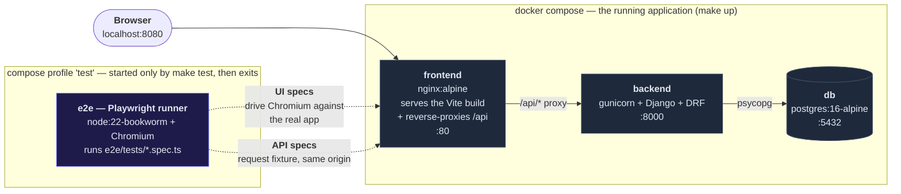

# Build Plan — Vertical Slices

Each slice is **independently shippable and independently green**. Backend-only slices are still verified
by Playwright, using its `request` fixture (`APIRequestContext`) — same runner, same `make test`, no second
test framework to stand up. UI slices layer on top.

Rule: no slice starts until the previous slice's validation passes. Commit per slice.

Related: [SPEC.md](./SPEC.md) · [TEST_PLAN.md](./TEST_PLAN.md) · [OPEN_QUESTIONS.md](./OPEN_QUESTIONS.md)

---

## Architecture

**`e2e` is the Playwright test container** — the E2E suite packaged as a service, behind a `test` profile
so `make up` never starts it. `make test` builds it, runs it once against the live stack, and it exits with
the suite's status code; that is what keeps `make test` self-contained on a machine with only make, docker
and bash.

It drives the app through the same nginx origin the browser uses — API specs included — so the tests
exercise the real request path, proxy and all. That single origin is also why there is no CORS config
anywhere and no API base URL baked in at build time.

The status write is the one piece of non-obvious logic, so it gets its own diagram:

```mermaid
sequenceDiagram
    autonumber
    participant UI as React (optimistic)
    participant API as DRF JobViewSet
    participant SVC as services.record_status()
    participant DB as Postgres

    UI->>UI: badge → RUNNING immediately
    UI->>API: PATCH /api/jobs/12/ {status:"RUNNING"}
    API->>SVC: record_status(job, RUNNING)

    rect rgb(30,41,59)
    note over SVC,DB: transaction.atomic()
    SVC->>DB: SELECT … FOR UPDATE (job row lock)
    SVC->>DB: INSERT JobStatus(job, RUNNING, now())
    alt new.timestamp >= job.current_status_at
        SVC->>DB: UPDATE job SET current_status, current_status_at
    else stale / replayed event
        SVC-->>SVC: append only, projection untouched
    end
    end

    API-->>UI: 200 {current_status:"RUNNING", …}
    UI->>UI: reconcile cache
    Note over UI: on 4xx/5xx → roll back badge,<br/>surface ErrorBanner
```

The log is appended unconditionally; only the **projection** is conditional. That's what makes the write
safe to replay, and what keeps the log authoritative if the projection ever needs rebuilding.

---

## Error handling is cross-cutting, not a slice

It is part of each slice's definition of done, never retrofitted:

| Layer | Built in | What it does |
|---|---|---|
| DRF exception handler → uniform `{detail, errors}` | Slice 1 | every 4xx/5xx has one predictable shape |
| Model + serializer validation | Slice 2 | rejects blank/oversized names at the boundary |
| Typed client normalizes network + HTTP + parse failures | Slice 5 | one `ApiError` type, one place to change |
| `ErrorBanner` + query error states | Slice 5 | no blank screens, ever |
| Client-side form validation | Slice 6 | blocks the request before it is sent |
| Optimistic mutation + rollback on failure | Slice 7 | the UI never lies about persisted state |

Slice 9 is therefore a **fault-injection sweep** — a spec that systematically proves the handling built in
slices 1–8 holds under 500s, aborts, and slow responses — not the place where handling gets written.

---

## Validation tiers

| Tier | Command | Cost | When |
|---|---|---|---|
| **T1 — lightweight** | `make test-spec SPEC=<name>` (one spec, running stack, no rebuild) · `make test-backend` | seconds | after every meaningful change, inside a slice |
| **T2 — suite** | `make test` (rebuild + full Playwright suite) | ~1–2 min | close of **every** slice |
| **T3 — cold gate** | `make clean && make build && make test` from pruned Docker + `--platform linux/amd64` check | several min | slices **0, 4, 7, 11**, and any slice touching Docker/compose/Makefile/dependencies |

---

## Slices

Legend: **S** = size · **Spec** = the Playwright file that proves it · **Cases** = IDs from
[TEST_PLAN.md](./TEST_PLAN.md) §3.

### Slice 0 — Walking skeleton
**S: M** · **Spec:** `00-smoke` · **Cases:** A1, A2, A4 · **Validation: T3**

Compose stack (db + backend + frontend + e2e), Dockerfiles, Makefile (`build up test test-spec
test-backend test-all stop clean seed logs time`), `GET /api/health/`, React app rendering a title.

- `GET /api/health/` → 200, `{status:"ok", database:"ok"}`
- UI: page loads, heading visible, no console errors

*Why first:* `make test` passing on a clean machine is the one gate the evaluation cannot get past. Build
the pipe before the water. **Test plan sign-off happens here**, against a working harness.

### Slice 1 — Models + list endpoint
**S: M** · **Spec:** `01-jobs-list-api` · **Cases:** E1, E2, E7, E8 · **Validation: T1 → T2**

Models, migrations, composite indexes, DRF serializer, cursor-paginated `GET /api/jobs/`, uniform exception
handler, `seed_jobs` management command.

- `{results, next, previous}` shape; each result carries `id, name, current_status, current_status_at,
  created_at, updated_at`
- newest-first, stable across reloads
- `?page_size=2` → 2 results + non-null `next`; following `next` returns a **disjoint** set

### Slice 2 — Create + automatic PENDING
**S: S** · **Spec:** `02-create-job-api` · **Cases:** B1, B2, B3, B4, B6, B7 · **Validation: T1 → T2**

`POST /api/jobs/`, atomic job + initial status, name validation. A job must never exist with an empty log.

### Slice 3 — PATCH: append event, update projection
**S: M** · **Spec:** `03-update-job-api` · **Cases:** C1, C3, C4, C5, C6, C8, C9, C10 · **Validation: T1 → T2**

Write-only `status` serializer field, `record_status()` with `select_for_update()` + atomic block, the
monotonic guard. C9 (two concurrent PATCHes, no lost update) is the case that proves the lock.

### Slice 4 — Delete + cascade + history endpoint
**S: S** · **Spec:** `04-delete-job-api` · **Cases:** D1, D2, D3, D4 · **Validation: T3** (backend complete)

`DELETE` → 204 with the ORM cascade removing every `JobStatus` row; `GET /api/jobs/<id>/statuses/`.
D2 proves the history is unreachable via the API, D3 (backend unit) proves no orphan rows survive — the
E2E check alone cannot tell those apart.

### Slice 4.5 — UI mockup & design sign-off 🔍
**S: S** · **Spec:** none — this is a review gate · **Validation: explicit approval before slice 5**

One self-contained HTML page showing **every state the UI can be in**, with hard-coded data, no backend and
no React. Reviewed and approved before a line of component code is written.

States it must show:

| Area | States |
|---|---|
| Job list | populated (all four status badges), empty, loading, error + retry |
| Create form | idle, invalid (empty / whitespace), submitting, server error with input preserved |
| Status control | dropdown closed, dropdown open, update in flight (optimistic), rolled back after failure |
| History | timeline collapsed, expanded |
| Delete | button, in-app confirm dialog (never `window.confirm`), row-restored-after-failure |
| Scale controls | status filter, search box, "load more" affordance, end-of-list |

*Why the gate exists:* a layout or interaction problem caught on a static page costs minutes. The same
problem caught after slices 5–8 are wired through TanStack Query means unpicking components, tests and
optimistic-update logic that were all built on the wrong shape.

*Why it sits here but need not run here:* it has **no backend dependency**, so it can be built and reviewed
in parallel with slices 2–4 rather than blocking after them. The only hard constraint is that it is
approved before slice 5 starts.

Deliverable: a viewable page (published artifact link) plus the same file committed under `docs/mockup/`.

### Slice 5 — Frontend: job list
**S: M** · **Spec:** `05-job-list-ui` · **Cases:** E1, E3, E6 · **Validation: T1 → T2**

Typed API client, TanStack Query, `JobList`/`JobRow`/`StatusBadge`/`StatusTimeline`/`ErrorBanner`, loading
and empty states, styling pass.

### Slice 6 — Frontend: create form
**S: S** · **Spec:** `06-create-job-ui` · **Cases:** B1, B2, B3 · **Validation: T1 → T2**

Empty and whitespace-only names blocked client-side with **zero network requests**; valid name appears at
the top of the list without a refresh; input clears on success.

### Slice 7 — Frontend: status update ⭐
**S: M** · **Spec:** `07-update-status-ui` · **Cases:** C1, C2, C7 · **Validation: T3**

*The prompt's named critical flow — the one an evaluator looks for first.*

Create → assert `PENDING` → change to `RUNNING` → badge updates → **survives reload**. All four states
reachable. Optimistic update with rollback on failure.

### Slice 8 — Frontend: delete
**S: S** · **Spec:** `08-delete-job-ui` · **Cases:** D1, D5, D6 · **Validation: T1 → T2**

Row disappears without refresh and stays gone after reload. Any confirm step is an in-app dialog —
**never `window.confirm`**, which blocks automation and would hang the suite.

### Slice 9 — Fault-injection sweep
**S: M** · **Spec:** `09-fault-injection` · **Cases:** B5, C7, D5, E4, E5 · **Validation: T2**

`page.route()` fault injection proves the handling built in slices 1–8 holds: 500 on each verb, aborted
requests, slow responses, optimistic rollback, and recovery once the route is unblocked.

### Slice 10 — Scale: pagination, filter, search
**S: M** · **Spec:** `10-pagination-scale` · **Cases:** F1–F9 · **Validation: T2 + latency measurement**

Seed a large dataset (`make seed N=250000`), load-more/infinite scroll, server-side status filter,
debounced search. F8/F9 mutate the list *during* a walk — deleting rows behind the cursor is the case
that breaks offset pagination and that keyset pagination is immune to.
 Virtualize if rendered row count warrants it. F7's measured numbers go in the README.

### Slice 11 — Delivery
**S: M** · **Spec:** full suite · **Validation: T3 ×2** (warm, then fully pruned)

README: setup, architecture, **performance writeup**, **prompt-engineering writeup**, time spent (from
`make time`). Final tidy.

---

## Sequencing notes

- Slices 0–4 give a complete, demonstrable backend before any UI exists. If time runs short the fallback is
  a smaller UI, never a broken `make test`.
- Slice 7 is the prompt's explicitly required E2E test. It ships mid-build, not at the end.
- Slices 9 and 10 are where the "error handling" and "performance" criteria are actually won — not optional
  polish.

## Test isolation

E2E runs against a real Postgres, so no spec may assume an empty database. Every spec creates fixtures with
a run-unique prefix (`e2e-<uuid>-…`), scopes assertions to those rows, and cleans up. No test depends on
another's leftovers; the suite is safe to re-run without `make clean` (case A3).
