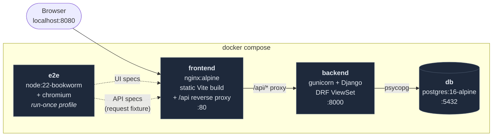
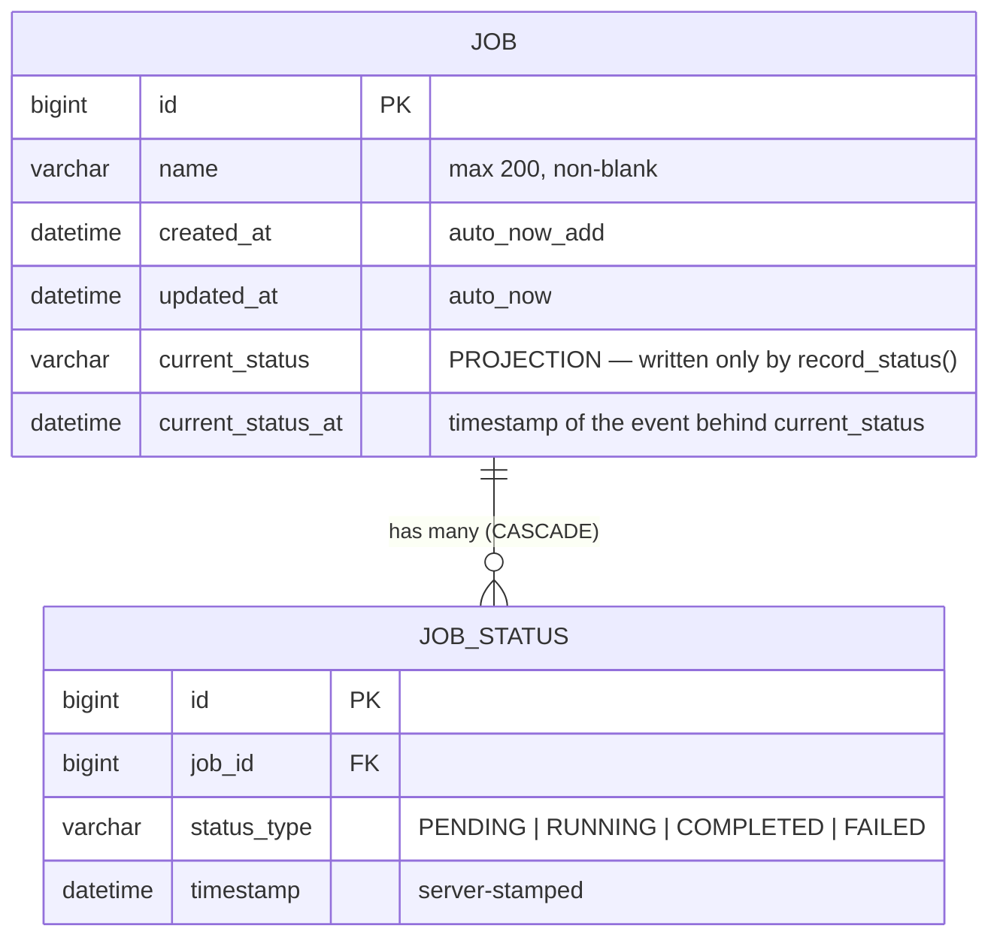

# Job Management Dashboard — Working Spec

Status: **agreed** — open questions resolved in [OPEN_QUESTIONS.md](./OPEN_QUESTIONS.md).
Source of truth: `docs/EM_job_management_dashboard.pdf`
Related: [PLAN.md](./PLAN.md) · [TEST_PLAN.md](./TEST_PLAN.md)

---

## 0. Architecture



nginx proxying `/api` gives the browser and Playwright a **single origin** — no CORS configuration, and no
API base URL baked in at build time, so the same image runs anywhere. The e2e container drives everything
through that same origin, meaning the tests exercise the real request path rather than a shortcut around
it.

### Data model



`JOB_STATUS` is the **source of truth** — an append-only log of observations, never updated, never deleted
except by cascade. The two `current_*` columns on `JOB` are a **projection** of that log, kept in the same
transaction as the event that produces them. §3 explains why the projection exists and what keeps it
honest.

### The status write

The one piece of non-obvious control flow:

```mermaid
sequenceDiagram
    autonumber
    participant UI as React (optimistic)
    participant API as DRF JobViewSet
    participant SVC as services.record_status()
    participant DB as Postgres

    UI->>UI: badge → RUNNING immediately
    UI->>API: PATCH /api/jobs/12/ {status:"RUNNING"}
    API->>SVC: record_status(job, RUNNING)

    rect rgb(30,41,59)
    note over SVC,DB: transaction.atomic()
    SVC->>DB: SELECT … FOR UPDATE (job row lock)
    SVC->>DB: INSERT JobStatus(job, RUNNING, now())
    alt new.timestamp >= job.current_status_at
        SVC->>DB: UPDATE job SET current_status, current_status_at
    else stale / replayed event
        SVC-->>SVC: append only, projection untouched
    end
    end

    API-->>UI: 200 {current_status:"RUNNING", …}
    UI->>UI: reconcile cache
    Note over UI: on 4xx/5xx → roll back badge,<br/>surface ErrorBanner
```



The event is appended **unconditionally**; only the projection is conditional. That is what makes the write
safe to replay, and what keeps the log authoritative if the projection ever has to be rebuilt.

---

## 1. Understanding of the domain

Two entities, one-to-many.

**`Job`** is the durable thing a user names and manages.
**`JobStatus`** is an append-only *event* — "at time T, this job was observed to be in state S". Nothing in
the prompt says status rows are ever mutated or removed, and the PATCH requirement ("this action should
involve creating a *new* JobStatus entry") confirms it: status changes are recorded, not overwritten. So
`JobStatus` is an event log and `Job.current_status` is a projection of it.

That framing drives most of the design decisions below.

### Models

```python
class Job(models.Model):
    id                 # BigAutoField, PK
    name               # CharField(max_length=200), non-empty (validated)
    created_at         # auto_now_add=True
    updated_at         # auto_now=True

    # --- denormalized projection of the JobStatus log (see §3) ---
    current_status     # CharField(choices=StatusType), default PENDING
    current_status_at  # DateTimeField — timestamp of the JobStatus row that produced current_status
```

```python
class JobStatus(models.Model):
    id           # BigAutoField, PK
    job          # FK(Job, on_delete=CASCADE, related_name="statuses")
    status_type  # CharField(choices=StatusType)
    timestamp    # DateTimeField(default=timezone.now, db_index via composite below)
```

```python
class StatusType(models.TextChoices):
    PENDING   = "PENDING"
    RUNNING   = "RUNNING"
    COMPLETED = "COMPLETED"
    FAILED    = "FAILED"
```

Stored as strings, not ints — readable in the DB and in API payloads, and adding a state later doesn't
require a data migration.

### Indexes

| Index | Purpose |
|---|---|
| `JobStatus (job_id, timestamp DESC, id DESC)` | latest-status lookup; also makes cascade delete cheap |
| `Job (created_at DESC, id DESC)` | keyset pagination on the default ordering |
| `Job (current_status, created_at DESC, id DESC)` | filter-by-status without a full scan |

`id DESC` is the tiebreaker everywhere so ordering is **total**, not just deterministic-ish. Two rows with
an identical timestamp must still have a stable order or keyset pagination can skip or repeat rows.

---

## 2. API

Django REST Framework, `ModelViewSet`-shaped, JSON only.

### `GET /api/jobs/`
List jobs, newest first, **cursor-paginated**.

```
GET /api/jobs/?status=RUNNING&search=fluid&cursor=<opaque>&page_size=25
```

```json
{
  "next": "http://.../api/jobs/?cursor=cD0yMDI2...",
  "previous": null,
  "results": [
    {
      "id": 12,
      "name": "Fluid Dynamics Simulation",
      "current_status": "RUNNING",
      "current_status_at": "2026-07-25T10:14:02.113Z",
      "created_at": "2026-07-25T09:58:41.001Z",
      "updated_at": "2026-07-25T10:14:02.118Z"
    }
  ]
}
```

Cursor rather than page-number pagination is a deliberate choice — see §4.

### `POST /api/jobs/`
```json
// request
{ "name": "ML Model Training" }
// 201 response: full job object, current_status == "PENDING"
```
Creates the `Job` **and** its initial `PENDING` `JobStatus` inside one `transaction.atomic()` block. A job
must never exist with an empty status log.

Validation: `name` required, trimmed, non-empty, ≤200 chars → `400` with
`{"name": ["This field may not be blank."]}`.

### `PATCH /api/jobs/<id>/`
```json
{ "status": "RUNNING" }        // appends a JobStatus event
{ "name": "Renamed job" }      // rename only, no status event
{ "name": "x", "status": "FAILED" }  // both, atomically
```

`status` is a **write-only** field on the serializer: it is not a column on `Job`, it is an instruction to
append to the log. Response is the full job object with the refreshed `current_status`.

Concurrency: the whole PATCH runs inside `transaction.atomic()` with `select_for_update()` on the `Job`
row, so two simultaneous status changes serialize instead of racing on the projection.

Errors: unknown status → `400`; unknown id → `404`.

### `DELETE /api/jobs/<id>/`
`204 No Content`. `on_delete=CASCADE` removes all `JobStatus` rows — enforced at the DB level by the FK
constraint, not only in Django, so it holds for raw SQL too.

### `GET /api/health/`
`{"status": "ok", "database": "ok"}` — used by the compose healthcheck and by `make test` to know when the
stack is actually ready. Prevents the flaky "test suite starts before Postgres finishes initializing"
failure mode, which is exactly the kind of thing that makes an evaluator's `make test` fail.

---

## 3. How current status is derived and stored

**Decision: denormalize onto `Job`, with an append-only log as the source of truth.**

The two candidate designs:

**(a) Derive on read.** `Job.objects.annotate(current_status=Subquery(latest_status))`. Perfectly normalized,
no projection to keep in sync. Cost: a correlated subquery per row. For a 25-row page that's genuinely fine
(25 index seeks). It falls apart the moment you want `?status=RUNNING` or "sort by status" — Postgres has to
compute the latest status for *every* job in the table before it can filter, which is a full scan over
millions of rows and cannot use an index.

**(b) Denormalize `current_status` onto `Job`.** Listing, filtering, and sorting all become plain indexed
column reads. Cost: a projection that can drift from the log.

I'm choosing **(b)**, because filtering by status is table stakes for a dashboard and is precisely the query
that (a) can't serve at scale. The drift risk is contained by writing the projection in the *same
transaction* as the event, never anywhere else, and by keeping the log authoritative — if the projection is
ever wrong it can be recomputed from the log with a one-line management command. That's the standard
trade: the log is truth, the column is a cache.

### The update guard

Confirming your instinct, with one refinement. The rule is:

```python
if new_status.timestamp >= job.current_status_at:
    job.current_status = new_status.status_type
    job.current_status_at = new_status.timestamp
```

Compare against **`current_status_at`**, not `updated_at`. `updated_at` moves on *every* save — a rename
bumps it — so a rename could make a later legitimate status event look "stale" and get dropped. Guarding on
the timestamp of the status that produced the current projection is the monotonic invariant we actually
want: *the projection always reflects the newest event the log has seen.*

Practically this guard is a no-op today, because the server stamps `timestamp = now()` and the row lock
serializes writers. It earns its keep the moment status events arrive from somewhere other than a human
clicking a dropdown — a real scheduler emitting `RUNNING`/`COMPLETED` webhooks, a retried delivery, a
backfill — where out-of-order arrival is normal. It costs one comparison and makes the write idempotent
under replay, so it goes in now. (Timestamps are server-stamped — OPEN_QUESTIONS Q3 — which is what makes
the guard inert today rather than load-bearing.)

---

## 4. "Millions of jobs"

Agreed with your reading, and I'd make it explicit in the README as a stated assumption: **the dataset is
large; a single user's viewport is not.** Nobody scrolls a million rows. The engineering problem is
therefore "make every query cost proportional to the *page*, not to the *table*", at all three layers:

**Database.** Composite indexes covering the exact `ORDER BY` + `WHERE` of the list query (§1). Cascade
delete indexed on `job_id`. No `N+1` — the projection column means listing jobs touches one table.

**API.** Cursor pagination, for two specific reasons:
- `OFFSET 500000` makes Postgres walk and discard 500k rows. A keyset predicate
  (`WHERE (created_at, id) < (:cursor)`) is an index seek — page 20,000 costs the same as page 1.
- DRF's `PageNumberPagination` issues a `COUNT(*)` on every request to compute `count`. On a multi-million-row
  table that's a full index scan *per page load*. Cursor pagination has no count. If the UI needs a total,
  it should be an approximation (`pg_class.reltuples`) on a separate, cached endpoint — not on the hot path.

The trade-off, stated honestly: cursor pagination gives up "jump to page 47". For a feed-shaped dashboard
that's the right trade; filter and search are how users actually narrow a million rows, so those get built
instead.

**Frontend.** Fetch one page at a time (default 25) with "load more"/infinite scroll. If the rendered list
can grow past a few hundred rows in one session, virtualize it so DOM node count stays bounded regardless
of how many rows have been loaded. Server-side filter + debounced search so narrowing never pulls the full
set client-side. Optimistic updates on status change so the UI doesn't wait on a round trip.

Scoping note: I'll *implement* the pagination/index/query work (it's cheap and it's the part that's real),
and I'll *describe* the things that are genuinely out of scope for a few-hour build in the README —
read replicas, caching layers, cursor-based sync, partitioning `JobStatus` by time.

---

## 5. Frontend

Vite + React + TypeScript. Server state via TanStack Query (caching, invalidation, and error/loading states
are the bulk of what this app does — hand-rolling that is more code, not less). Styling: CSS Modules or
Tailwind, decided at slice 5.

Components stay small and dumb: `JobList` → `JobRow` → `StatusBadge` / `StatusSelect` / `DeleteButton`;
`CreateJobForm`; `ErrorBanner`. All API access goes through one typed `api/jobs.ts` client so error handling
and the base URL live in exactly one place.

Behaviours required by the prompt, mapped to slices in [PLAN.md](./PLAN.md): dynamic updates after every
mutation, client-side validation on the create form, visible error messages on any API failure.

---

## 6. Deployment

`docker compose` with four services: `db` (postgres:16-alpine), `backend` (Django + gunicorn), `frontend`
(Vite build served by nginx, which also reverse-proxies `/api` to avoid CORS entirely), and `e2e` (Playwright,
run-once profile).

`make test` must be self-contained: build → up → wait for `/api/health/` → run Playwright → report. It cannot
assume the stack is already running, and it must not require anything on the host beyond make/docker/bash.

**Gotcha flagged early:** the evaluation environment may only assume **DockerHub** access. The usual
Playwright image (`mcr.microsoft.com/playwright`) is *not* on DockerHub. The e2e image must therefore be
built from a DockerHub base (`node:22-bookworm`) with `npx playwright install --with-deps chromium` at build
time. Getting this wrong means `make test` fails on the evaluator's machine, which per the prompt ends the
evaluation.

Also: pin every base image tag, and make sure the whole thing builds on `linux/amd64` as well as Apple
Silicon.
